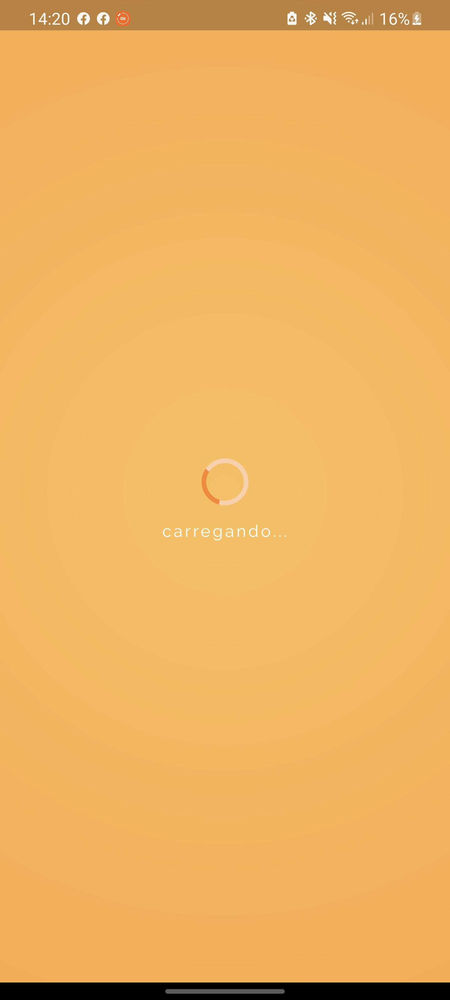
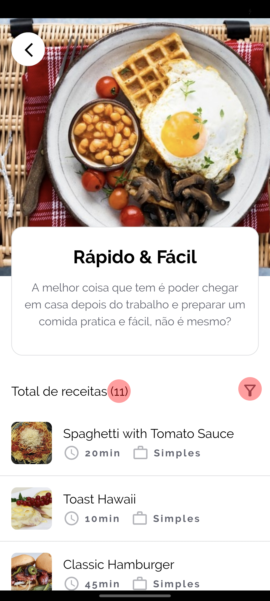

<!--
repo name: BEST-README
description: An awesome README template to jumpstart your projects!
github name:  ayrongabriel
link: https://github.com/ayrongabriel
logo path: assets/images/logo.png
screenshot: assets/screens/screen.gif
email: ayrongabriel@gmail.com
-->

<!-- PROJECT LOGO -->
<br />
<p align="center">
    <a href="LINK">
        
    </a>
    <h3 align="center">Minhas Receitas</h3>
</p>
<br><br>


## Tabela de Conteúdo

* [Sobre](#sobre)
* [Color](#color)
* [Fontes](#fontes)
* [Packages](#packages)
* [Figma](#figma)
* [Screenshots](#screenshots)
* [Gif](#gif)


<br>

## Sobre

Projeto desenvolvido através do curso [Aprenda Flutter e Desenvolva Apps Para Android e IOS 2020 da Cod3r](https://www.udemy.com/course/curso-flutter/). 
<br>Módulo -  Navegação & Múltiplas Telas. <br>

O aplicativo mostra categorias de alimentos com várias refeições. Cada refeição tem seus detalhes como: resumo, igredientes, passo a passo, tempo gasto...

<br>

#### Conteúdo visto

- Navigator (pushNamed(), pushReplacementName(), pop()...)
- Tabs (Navegação em abas)
- Drawer (Perzonalizado)
- Passando dados via construtor
- Retornando dados a partir do Pop() e recuperando através do then().

<br>

#### Alterações

- Layout do aplicativo
- Add imagem e descrição no dummy_category
- Add variaveis description, imageUrl no Model de categoria.
- Tela de Splash simulando carregamento com ```Future.delayed```
- Animando de transição nos thumbnails com Widget Hero
- AddiIcone e nome no Launcher

<br>
<hr>
<br>

## Fontes
- [Raleway](https://fonts.google.com/specimen/Raleway#standard-styles)
- [Roboto Condensed](https://fonts.google.com/specimen/Roboto+Condensed?query=Roboto+Condensed)

<br>
<hr>
<br>

## Color
```dart
static const primary = Color(0xFFFF8527);
static const secondary = Color(0xFFFFB945);
static const white = Colors.white;
static const background = Color(0xFFF2F3F4);
static const border = Color(0xFFE1E2E3);
```
<br>
<hr>
<br>

## Packages
- [flutter_staggered_grid_view](https://pub.dev/packages/flutter_staggered_grid_view)
- [flutter_launcher_icons](https://pub.dev/packages/flutter_launcher_icons)

<br>
<hr>
<br>

## Figma
[Mallika UI Kit](https://www.figma.com/file/Fm5uF9Ge6LmcDChr6Aj7v5/Mallika-UI-Kit-Community)

<br>
<hr>
<br>

## Screenshots

            
<br>
<hr>
<br>

## Gif
<p align="center">

</p>

<br>
<hr>
<br>

<!-- LICENSE -->
## License

Distributed under the MIT License. See `LICENSE` for more information.